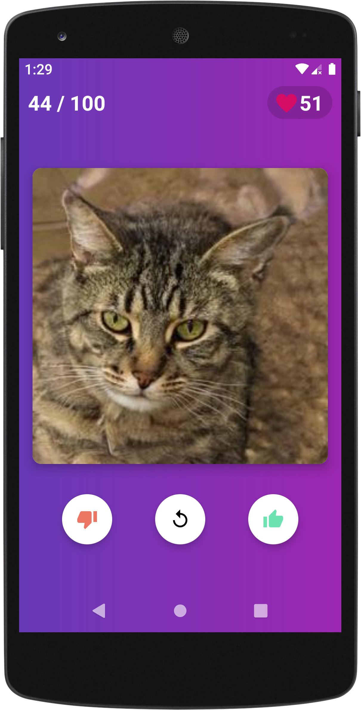
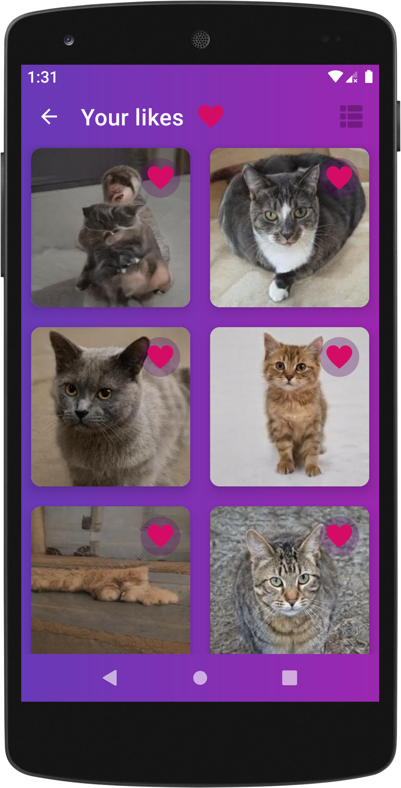
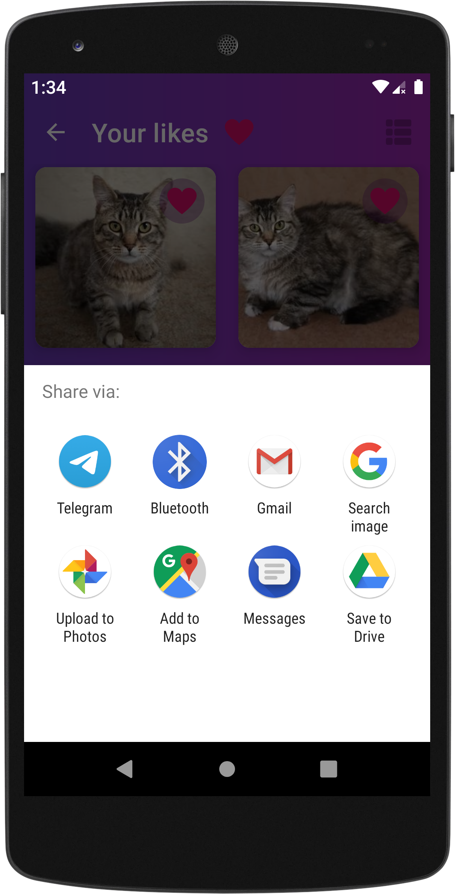

### SwipeCat
An android app displaying neural generated cats from https://thesecatsdonotexist.com/

### Screenshots

### Features
- List cats with Tinder-like cards.
- Swipe right to add the cat to favourites.
- Share a cat from favourites by clicking on the picture.

### Technology notes
- Single activity with fragments. No navigation lib is used in order to practice with FragmentManager.
- [Hilt](https://dagger.dev/hilt/) dependency injection.
- [CardStackView](https://github.com/yuyakaido/CardStackView) to implement Tinder-like cards for cats.
- [Room](https://developer.android.com/jetpack/androidx/releases/room) for storing Uri references to liked cats.
- [Glide](https://github.com/bumptech/glide) to display images in adapters without memory leaks.
- No libraries are used to download images to storage and their deletion in order to practice. Random cats fetching is implemented with generating a link to a file using a template and passing it to a trivial custom image downloader. 
- Use FileProvier + implicit intent to share cats via messangers and other apps.
- Use [Timber](https://github.com/JakeWharton/timber) logging in order to prevent log calls removal before every release building.
